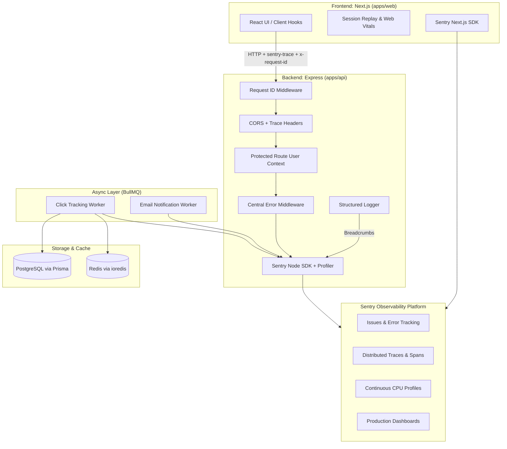

# Linkforge Production Observability Guide

Comprehensive documentation for the end-to-end production observability system across the Linkforge full-stack monorepo (`apps/web` Next.js frontend + `apps/api` Express backend + BullMQ workers + Redis + PostgreSQL/Prisma).

---

## Table of Contents
1. [Architecture Overview](#1-architecture-overview)
2. [Frontend Monitoring](#2-frontend-monitoring)
3. [Backend Monitoring](#3-backend-monitoring)
4. [User Context & Privacy](#4-user-context--privacy)
5. [Request ID Correlation](#5-request-id-correlation)
6. [Distributed Tracing](#6-distributed-tracing)
7. [Database Instrumentation (PostgreSQL / Prisma)](#7-database-instrumentation)
8. [Redis Instrumentation](#8-redis-instrumentation)
9. [BullMQ Background Worker Observability](#9-bullmq-background-worker-observability)
10. [Structured Logging](#10-structured-logging)
11. [Custom Performance Instrumentation & Spans](#11-custom-performance-instrumentation--spans)
12. [Web Vitals & Browser Performance](#12-web-vitals--browser-performance)
13. [Session Replay & Privacy Controls](#13-session-replay--privacy-controls)
14. [Node CPU Profiling](#14-node-cpu-profiling)
15. [Release Management](#15-release-management)
16. [Source Maps & Build Tooling](#16-source-maps--build-tooling)
17. [CI/CD Pipeline Integration](#17-cicd-pipeline-integration)
18. [Sensitive Data Scrubbing & Compliance](#18-sensitive-data-scrubbing--compliance)
19. [Dashboard Specifications](#19-dashboard-specifications)
20. [Alert Specifications](#20-alert-specifications)
21. [Step-by-Step Investigation Workflows](#21-step-by-step-investigation-workflows)

---

## 1. Architecture Overview

Linkforge implements a unified observability plane across client, server, background workers, and cache layers.



---

## 2. Frontend Monitoring
- **SDK**: `@sentry/nextjs` (v10.73+)
- **Configuration files**:
  - `apps/web/sentry.client.config.ts`: Client-side errors, browser performance, session replays.
  - `apps/web/sentry.server.config.ts`: Next.js Node server-side render errors and API routes.
  - `apps/web/sentry.edge.config.ts`: Edge runtime handlers & middleware.
  - `apps/web/instrumentation.ts` & `apps/web/instrumentation-client.ts`: Next.js App Router hooks.
- **Tunneling**: Route `/monitoring` configured in `next.config.ts` to bypass client-side ad-blockers.

---

## 3. Backend Monitoring
- **SDK**: `@sentry/node` (v10.73+) and `@sentry/profiling-node` (v10.74+)
- **Initialization**: Loaded as the first import in `apps/api/server.ts` via `instrument.ts` and `src/lib/sentry.ts`.
- **Error Handler Placement**: `Sentry.setupExpressErrorHandler(app)` is mounted after all business routes and immediately before `errorMiddleware`.

---

## 4. User Context & Privacy
- **Client**: Automatically synchronized by `<SentryAuthSync />` in `apps/web/app/providers.tsx` using `authClient.useSession()`.
- **Server**: Set per-request in `protectedRoute` middleware (`apps/api/src/middlewares/protected-routes.middleware.ts`) and enriched via `captureSentryWithRichContext`.
- **Scope Isolation**: Uses `Sentry.withScope` and request isolation scopes to guarantee no user context leaks across concurrent asynchronous requests.
- **Attributes Captured**:
  - `id`: Unique user UUID (passed to `Sentry.setUser`).
  - `username`: Creator username (if present).
  - `plan`: Normalized plan identifier (`free`, `pro`, `business`) attached as a low-cardinality tag.
  - **Never attached to tags**: User emails, raw tokens, or high-cardinality values.

---

## 5. Request ID Correlation
- **Middleware**: `apps/api/src/middlewares/request-id.middleware.ts`
- **Behavior**:
  1. Inspects incoming `X-Request-ID` header.
  2. If missing or invalid, generates a UUIDv4 via `crypto.randomUUID()`.
  3. Attaches to `req.id` and `req.requestId`.
  4. Echoes back `X-Request-ID` in HTTP response headers.
  5. Attaches `requestId` tag and context to Sentry and structured log entries.

---

## 6. Distributed Tracing
- **Frontend propagation**: `tracePropagationTargets: ["localhost", /^\/api/, process.env.NEXT_PUBLIC_BACKEND_URL]` configured in `sentry.client.config.ts` and `sentry.server.config.ts`.
- **Backend CORS headers**: `apps/api/src/middlewares/cors.ts` explicitly allows `sentry-trace`, `baggage`, `x-request-id`, and `X-Request-ID`.
- **Trace Continuity**: Browser action → Next.js fetch → Express API route → Database/Redis spans all share the same `trace_id`.

---

## 7. Database Instrumentation
- **ORM / Engine**: Prisma with PostgreSQL (`@prisma/client`).
- **Tracing**: `@sentry/node` automatically hooks into query executions through OpenTelemetry instrumentation.
- **Privacy**: Query parameter values and sensitive columns are sanitized; execution durations are tracked as child spans.

---

## 8. Redis Instrumentation
- **Client**: `ioredis` (`apps/api/src/lib/redis.ts`).
- **Error Tracking**: Connection drops and operational errors are logged with structured events (`redis.connection.error`) and captured in Sentry when in production.

---

## 9. BullMQ Background Worker Observability
- **Workers**: `clickWorker` (`click-tracking`), `emailWorker` (`email-notification`).
- **Span Tracking**: Each job execution is wrapped in `Sentry.startSpan`:
  - `name`: `bullmq.<queue_name>.<job_name>`
  - `op`: `queue.process`
  - Attributes: `queue.name`, `job.name`, `job.id`, `job.attempt`.
- **Error Propagation**: Exceptions are tagged with job details and captured in Sentry, then **re-thrown** so BullMQ retry counters and dead-letter queues function properly.

---

## 10. Structured Logging
- **Location**: `apps/api/src/lib/logger.ts`
- **Format**: Structured JSON output to stdout/stderr.
- **Event Naming Convention**: `resource.action.result` (e.g. `auth.login.success`, `api.request.error`, `redis.connect.success`, `queue.job.failed`).
- **Sentry Integration**: Automatically adds a lightweight Sentry breadcrumb (`Sentry.addBreadcrumb`) for every log without artificially turning logs into error issues.

---

## 11. Custom Performance Instrumentation & Spans
- Use `trackSpan` from `apps/api/src/utils/sentry-context.ts`:
  ```typescript
  import { trackSpan } from "@/utils/sentry-context";

  const data = await trackSpan(
    { name: "expensive.calculation", op: "custom.compute" },
    async () => {
      return computeAnalytics();
    }
  );
  ```

---

## 12. Web Vitals & Browser Performance
- Automatically captures Core Web Vitals:
  - **LCP** (Largest Contentful Paint)
  - **INP** (Interaction to Next Paint)
  - **CLS** (Cumulative Layout Shift)
  - **TTFB** (Time to First Byte)
  - **FCP** (First Contentful Paint)

---

## 13. Session Replay & Privacy Controls
- **Sampling**:
  - Session replay sample rate: `0.05` (5% in production, 10% in dev).
  - Error replay sample rate: `1.0` (100% of sessions encountering unhandled errors).
- **Privacy Masking**:
  - `maskAllText: true` (masks all user-entered text by default).
  - `maskAllInputs: true` (ensures password, card, and personal form inputs are masked).
  - `blockAllMedia: false` (allows layout images while scrubbing content).

---

## 14. Node CPU Profiling
- Enabled via `@sentry/profiling-node` integration in `apps/api/src/lib/sentry.ts`.
- Evaluates CPU flame graphs during active transaction spans (`profileLifecycle: "trace"`).
- Profile sample rate: `0.1` (10%) in production, `1.0` (100%) in development.

---

## 15. Release Management
- Logical release naming conventions:
  - Frontend: `linkforge-web@<GIT_COMMIT_SHA>`
  - Backend: `linkforge-api@<GIT_COMMIT_SHA>`
- Automatic fallback to `process.env.GIT_SHA` or `process.env.NEXT_PUBLIC_VERCEL_GIT_COMMIT_SHA`.

---

## 16. Source Maps & Build Tooling
- Configured via `withSentryConfig` in `apps/web/next.config.ts`.
- `widenClientFileUpload: true` enables full stack frame un-minification.
- Secrets (`SENTRY_AUTH_TOKEN`) are restricted to CI build environments and never exposed in client bundles.

---

## 17. CI/CD Pipeline Integration
- Integrated into `.github/workflows/deploy.yml`:
  1. Quality Gate (lint, type-check, tests).
  2. Build with source-map generation.
  3. Deploy API to Railway and Web to Vercel.
  4. Health check validation (`GET /health`).

---

## 18. Sensitive Data Scrubbing & Compliance
- **Rule**: Passwords, authorization tokens, cookies, Stripe secrets, and credit cards are NEVER sent to Sentry.
- **Multi-layer Scrubbing**:
  1. `beforeSend` hooks in `sentry.client.config.ts`, `sentry.server.config.ts`, and `src/lib/sentry.ts` strip sensitive headers (`authorization`, `cookie`, `set-cookie`, `stripe-signature`, `x-api-key`).
  2. `scrubSensitiveData` in `apps/api/src/lib/logger.ts` redacts sensitive JSON keys.
  3. `sendDefaultPii: false` enabled across all configurations.

---

## 19. Dashboard Specifications
See [docs/observability/sentry-human-setup.md](./sentry-human-setup.md) for full widget definitions covering Errors, Latency (p50/p95/p99), BullMQ Queues, Redis, and Web Vitals.

---

## 20. Alert Specifications
See [docs/observability/sentry-human-setup.md](./sentry-human-setup.md) for exact alert conditions (Alerts 1–6) including New Issue, Error Spike, Failure Rate Spike, p95/p99 Latency, and Infrastructure Failures.

---

## 21. Step-by-Step Investigation Workflows

### A. Investigating an API Error
1. In Sentry, open the issue.
2. Check the **Tags**:
   - `endpoint`: e.g. `/api/v1/links/:id`
   - `method`: `POST`
   - `plan`: `pro`
   - `requestId`: e.g. `c4b182d3-1249-4328-98e1-51829e182390`
3. Check the **User Context**: View the affected `user.id`.
4. Check **Breadcrumbs**: Review the sequence of structured log events leading up to the failure.
5. In your server logs, filter by `requestId` to inspect correlated lines.

### B. Investigating a Slow Endpoint
1. Go to **Performance** → **Transactions**.
2. Sort by **p95 Duration**.
3. Select a slow transaction to view its span waterfall:
   - Identify whether time is spent in `db.query` (Prisma), `cache.get` (Redis), or external API calls (Resend/Stripe).
4. Click on the attached **Profile** to view the CPU flame chart.

### C. Investigating a Failed BullMQ Job
1. Filter Sentry Issues by tag `queue.name: click-tracking` or `queue.name: email-notification`.
2. Inspect the `job.name` and `job.id` in the context details.
3. Review the exception stack trace to fix the root cause (e.g. database constraint or mail provider rate limit).
