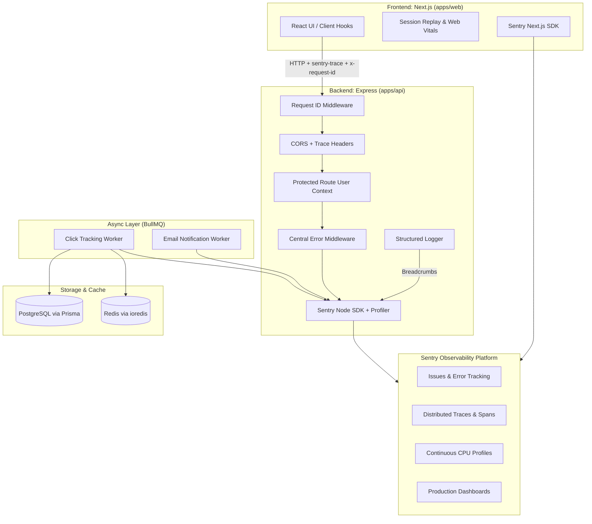

# Linkforge Production Observability Guide

Comprehensive documentation for the end-to-end production observability system across the Linkforge full-stack monorepo (`apps/web` Next.js frontend + `apps/api` Express backend + BullMQ workers + Redis + PostgreSQL/Prisma).

---

## Table of Contents
1. [Architecture Overview](#1-architecture-overview)
2. [Frontend Monitoring](#2-frontend-monitoring)
3. [Backend Monitoring](#3-backend-monitoring)
4. [User Context & Privacy](#4-user-context--privacy)
5. [Request ID Correlation](#5-request-id-correlation)
6. [Distributed Tracing](#6-distributed-tracing)
7. [Database Instrumentation (PostgreSQL / Prisma)](#7-database-instrumentation)
8. [Redis Instrumentation](#8-redis-instrumentation)
9. [BullMQ Background Worker Observability](#9-bullmq-background-worker-observability)
10. [Structured Logging](#10-structured-logging)
11. [Custom Performance Instrumentation & Spans](#11-custom-performance-instrumentation--spans)
12. [Web Vitals & Browser Performance](#12-web-vitals--browser-performance)
13. [Session Replay & Privacy Controls](#13-session-replay--privacy-controls)
14. [Node CPU Profiling](#14-node-cpu-profiling)
15. [Release Management](#15-release-management)
16. [Source Maps & Build Tooling](#16-source-maps--build-tooling)
17. [CI/CD Pipeline Integration](#17-cicd-pipeline-integration)
18. [Sensitive Data Scrubbing & Compliance](#18-sensitive-data-scrubbing--compliance)
19. [Dashboard Specifications](#19-dashboard-specifications)
20. [Alert Specifications](#20-alert-specifications)
21. [Step-by-Step Investigation Workflows](#21-step-by-step-investigation-workflows)
22. [Prometheus Metrics & Docker Scraping](#22-prometheus-metrics--docker-scraping)
23. [Grafana Observability Dashboards](#23-grafana-observability-dashboards)
24. [CTO Business Overview Dashboard & Prometheus Alerting](#24-cto-business-overview-dashboard)
25. [OpenTelemetry Distributed Tracing & Grafana Tempo](#25-opentelemetry-distributed-tracing--grafana-tempo)
26. [Production-Ready Structured Logging with Pino](#26-production-ready-structured-logging-with-pino)

---

## 1. Architecture Overview

Linkforge implements a unified observability plane across client, server, background workers, and cache layers.



---

## 2. Frontend Monitoring
- **SDK**: `@sentry/nextjs` (v10.73+)
- **Configuration files**:
  - `apps/web/sentry.client.config.ts`: Client-side errors, browser performance, session replays.
  - `apps/web/sentry.server.config.ts`: Next.js Node server-side render errors and API routes.
  - `apps/web/sentry.edge.config.ts`: Edge runtime handlers & middleware.
  - `apps/web/instrumentation.ts` & `apps/web/instrumentation-client.ts`: Next.js App Router hooks.
- **Tunneling**: Route `/monitoring` configured in `next.config.ts` to bypass client-side ad-blockers.

---

## 3. Backend Monitoring
- **SDK**: `@sentry/node` (v10.73+) and `@sentry/profiling-node` (v10.74+)
- **Initialization**: Loaded as the first import in `apps/api/server.ts` via `instrument.ts` and `src/lib/sentry.ts`.
- **Error Handler Placement**: `Sentry.setupExpressErrorHandler(app)` is mounted after all business routes and immediately before `errorMiddleware`.

---

## 4. User Context & Privacy
- **Client**: Automatically synchronized by `<SentryAuthSync />` in `apps/web/app/providers.tsx` using `authClient.useSession()`.
- **Server**: Set per-request in `protectedRoute` middleware (`apps/api/src/middlewares/protected-routes.middleware.ts`) and enriched via `captureSentryWithRichContext`.
- **Scope Isolation**: Uses `Sentry.withScope` and request isolation scopes to guarantee no user context leaks across concurrent asynchronous requests.
- **Attributes Captured**:
  - `id`: Unique user UUID (passed to `Sentry.setUser`).
  - `username`: Creator username (if present).
  - `plan`: Normalized plan identifier (`free`, `pro`, `business`) attached as a low-cardinality tag.
  - **Never attached to tags**: User emails, raw tokens, or high-cardinality values.

---

## 5. Request ID Correlation
- **Middleware**: `apps/api/src/middlewares/request-id.middleware.ts`
- **Behavior**:
  1. Inspects incoming `X-Request-ID` header.
  2. If missing or invalid, generates a UUIDv4 via `crypto.randomUUID()`.
  3. Attaches to `req.id` and `req.requestId`.
  4. Echoes back `X-Request-ID` in HTTP response headers.
  5. Attaches `requestId` tag and context to Sentry and structured log entries.

---

## 6. Distributed Tracing
- **Frontend propagation**: `tracePropagationTargets: ["localhost", /^\/api/, process.env.NEXT_PUBLIC_BACKEND_URL]` configured in `sentry.client.config.ts` and `sentry.server.config.ts`.
- **Backend CORS headers**: `apps/api/src/middlewares/cors.ts` explicitly allows `sentry-trace`, `baggage`, `x-request-id`, and `X-Request-ID`.
- **Trace Continuity**: Browser action → Next.js fetch → Express API route → Database/Redis spans all share the same `trace_id`.

---

## 7. Database Instrumentation
- **ORM / Engine**: Prisma with PostgreSQL (`@prisma/client`).
- **Tracing**: `@sentry/node` automatically hooks into query executions through OpenTelemetry instrumentation.
- **Privacy**: Query parameter values and sensitive columns are sanitized; execution durations are tracked as child spans.

---

## 8. Redis Instrumentation
- **Client**: `ioredis` (`apps/api/src/lib/redis.ts`).
- **Error Tracking**: Connection drops and operational errors are logged with structured events (`redis.connection.error`) and captured in Sentry when in production.

---

## 9. BullMQ Background Worker Observability
- **Workers**: `clickWorker` (`click-tracking`), `emailWorker` (`email-notification`).
- **Span Tracking**: Each job execution is wrapped in `Sentry.startSpan`:
  - `name`: `bullmq.<queue_name>.<job_name>`
  - `op`: `queue.process`
  - Attributes: `queue.name`, `job.name`, `job.id`, `job.attempt`.
- **Error Propagation**: Exceptions are tagged with job details and captured in Sentry, then **re-thrown** so BullMQ retry counters and dead-letter queues function properly.

---

## 10. Structured Logging
- **Location**: `apps/api/src/lib/logger.ts`
- **Format**: Structured JSON output to stdout/stderr.
- **Event Naming Convention**: `resource.action.result` (e.g. `auth.login.success`, `api.request.error`, `redis.connect.success`, `queue.job.failed`).
- **Sentry Integration**: Automatically adds a lightweight Sentry breadcrumb (`Sentry.addBreadcrumb`) for every log without artificially turning logs into error issues.

---

## 11. Custom Performance Instrumentation & Spans
- Use `trackSpan` from `apps/api/src/utils/sentry-context.ts`:
  ```typescript
  import { trackSpan } from "@/utils/sentry-context";

  const data = await trackSpan(
    { name: "expensive.calculation", op: "custom.compute" },
    async () => {
      return computeAnalytics();
    }
  );
  ```

---

## 12. Web Vitals & Browser Performance
- Automatically captures Core Web Vitals:
  - **LCP** (Largest Contentful Paint)
  - **INP** (Interaction to Next Paint)
  - **CLS** (Cumulative Layout Shift)
  - **TTFB** (Time to First Byte)
  - **FCP** (First Contentful Paint)

---

## 13. Session Replay & Privacy Controls
- **Sampling**:
  - Session replay sample rate: `0.05` (5% in production, 10% in dev).
  - Error replay sample rate: `1.0` (100% of sessions encountering unhandled errors).
- **Privacy Masking**:
  - `maskAllText: true` (masks all user-entered text by default).
  - `maskAllInputs: true` (ensures password, card, and personal form inputs are masked).
  - `blockAllMedia: false` (allows layout images while scrubbing content).

---

## 14. Node CPU Profiling
- Enabled via `@sentry/profiling-node` integration in `apps/api/src/lib/sentry.ts`.
- Evaluates CPU flame graphs during active transaction spans (`profileLifecycle: "trace"`).
- Profile sample rate: `0.1` (10%) in production, `1.0` (100%) in development.

---

## 15. Release Management
- Logical release naming conventions:
  - Frontend: `linkforge-web@<GIT_COMMIT_SHA>`
  - Backend: `linkforge-api@<GIT_COMMIT_SHA>`
- Automatic fallback to `process.env.GIT_SHA` or `process.env.NEXT_PUBLIC_VERCEL_GIT_COMMIT_SHA`.

---

## 16. Source Maps & Build Tooling
- Configured via `withSentryConfig` in `apps/web/next.config.ts`.
- `widenClientFileUpload: true` enables full stack frame un-minification.
- Secrets (`SENTRY_AUTH_TOKEN`) are restricted to CI build environments and never exposed in client bundles.

---

## 17. CI/CD Pipeline Integration
- Integrated into `.github/workflows/deploy.yml`:
  1. Quality Gate (lint, type-check, tests).
  2. Build with source-map generation.
  3. Deploy API to Railway and Web to Vercel.
  4. Health check validation (`GET /health`).

---

## 18. Sensitive Data Scrubbing & Compliance
- **Rule**: Passwords, authorization tokens, cookies, Stripe secrets, and credit cards are NEVER sent to Sentry.
- **Multi-layer Scrubbing**:
  1. `beforeSend` hooks in `sentry.client.config.ts`, `sentry.server.config.ts`, and `src/lib/sentry.ts` strip sensitive headers (`authorization`, `cookie`, `set-cookie`, `stripe-signature`, `x-api-key`).
  2. `scrubSensitiveData` in `apps/api/src/lib/logger.ts` redacts sensitive JSON keys.
  3. `sendDefaultPii: false` enabled across all configurations.

---

## 19. Dashboard Specifications
See [docs/observability/sentry-human-setup.md](./sentry-human-setup.md) for full widget definitions covering Errors, Latency (p50/p95/p99), BullMQ Queues, Redis, and Web Vitals.

---

## 20. Alert Specifications
See [docs/observability/sentry-human-setup.md](./sentry-human-setup.md) for exact alert conditions (Alerts 1–6) including New Issue, Error Spike, Failure Rate Spike, p95/p99 Latency, and Infrastructure Failures.

---

## 21. Step-by-Step Investigation Workflows

### A. Investigating an API Error
1. In Sentry, open the issue.
2. Check the **Tags**:
   - `endpoint`: e.g. `/api/v1/links/:id`
   - `method`: `POST`
   - `plan`: `pro`
   - `requestId`: e.g. `c4b182d3-1249-4328-98e1-51829e182390`
3. Check the **User Context**: View the affected `user.id`.
4. Check **Breadcrumbs**: Review the sequence of structured log events leading up to the failure.
5. In your server logs, filter by `requestId` to inspect correlated lines.

### B. Investigating a Slow Endpoint
1. Go to **Performance** → **Transactions**.
2. Sort by **p95 Duration**.
3. Select a slow transaction to view its span waterfall:
   - Identify whether time is spent in `db.query` (Prisma), `cache.get` (Redis), or external API calls (Resend/Stripe).
4. Click on the attached **Profile** to view the CPU flame chart.

### C. Investigating a Failed BullMQ Job
1. Filter Sentry Issues by tag `queue.name: click-tracking` or `queue.name: email-notification`.
2. Inspect the `job.name` and `job.id` in the context details.
3. Review the exception stack trace to fix the root cause (e.g. database constraint or mail provider rate limit).

---

## 22. Prometheus Metrics & Docker Scraping

### A. Overview & Architecture
The Express API integrates `prom-client` to expose production-grade process, runtime, and HTTP application metrics at `GET /metrics`.

```
[Client / Traffic] ───► [Nginx Gateway / Public /metrics] ───► [Express API:5000 /metrics]
                                                                        ▲
[Prometheus Container (port 9090)] ─── (internal Docker bridge) ────────┘
```

### B. Exposed Metrics

#### 1. Default Node.js and Process Metrics
Automatically collected by `prom-client.collectDefaultMetrics()`:
- `process_cpu_seconds_total`, `process_cpu_user_seconds_total`, `process_cpu_system_seconds_total` (CPU usage)
- `process_resident_memory_bytes`, `nodejs_heap_size_total_bytes`, `nodejs_heap_size_used_bytes`, `nodejs_external_memory_bytes` (Memory usage)
- `nodejs_eventloop_lag_seconds`, `nodejs_eventloop_lag_min_seconds`, `nodejs_eventloop_lag_max_seconds` (Event Loop lag)
- `nodejs_active_handles`, `nodejs_active_requests` (Active network handles & async requests)
- `process_start_time_seconds` (Process uptime)
- `nodejs_gc_duration_seconds` (Garbage collection pauses)

#### 2. Custom Application HTTP Metrics
- `http_requests_total`: Counter tracking total requests.
  - **Labels**: `method`, `route`, `status_code`
  - *Example*: `http_requests_total{app="linkforge-api",method="GET",route="/api/v1/links",status_code="200"}`
- `http_request_duration_seconds`: Histogram tracking request duration in seconds.
  - **Labels**: `method`, `route`, `status_code`
  - **Buckets**: `[0.005, 0.01, 0.025, 0.05, 0.1, 0.25, 0.5, 1, 2.5, 5, 10]` seconds (5ms to 10s)

#### 3. Custom Business & Workload Metrics
- `active_users_total`: **Gauge** tracking current unique users with valid unexpired sessions.
  - **Definition**: Count of distinct `userId`s with active sessions in PostgreSQL (`expiresAt > NOW()`).
  - **Update Strategy**: Periodically refreshed via background timer (every 30s) to eliminate DB query overhead on Prometheus scrapes.
- `links_created_total`: **Counter** tracking successfully created and persisted links.
  - **Increment point**: `apps/api/src/services/link.service.ts` immediately following successful `prisma.link.create`.
- `clicks_processed_total`: **Counter** tracking click events processed and persisted by BullMQ click worker.
  - **Increment point**: `apps/api/src/workers/click.worker.ts` immediately following successful `prisma.clickEvent.create`.
- `queue_depth`: **Gauge** tracking current pending work in BullMQ click tracking queue.
  - **Definition**: Sum of `waiting + delayed + prioritized` jobs in BullMQ `click-tracking` queue (excludes completed/failed history).
  - **Update Strategy**: Refreshed periodically via background timer.

### C. Useful PromQL Queries

| Use Case | PromQL Expression | Description |
|---|---|---|
| **Link Creation Rate** | `rate(links_created_total[5m])` | Number of links created per second over the last 5 minutes |
| **Links Created (1 Hour)** | `increase(links_created_total[1h])` | Net links created over the past hour |
| **Click Processing Rate** | `rate(clicks_processed_total[5m])` | Click events processed per second |
| **Current Active Users** | `active_users_total` | Real-time count of active authenticated users |
| **Queue Backlog / Depth** | `queue_depth` | Real-time pending BullMQ jobs awaiting worker processing |
| **Queue Growth Rate** | `deriv(queue_depth[5m])` | Rate of backlog accumulation or depletion |

### D. Operational Interpretation

- `active_users_total` → Reflects real product engagement and authenticated user traffic.
- `links_created_total` → Reflects core content creation activity across free and pro tiers.
- `clicks_processed_total` → Measures the successful throughput of the async analytics processing pipeline.
- `queue_depth` → Measures async processing pressure and backlog risk.

**Correlated Operational Signals**:
- **Queue Growth with Falling Processing Rate**:
  `queue_depth > 50` while `rate(clicks_processed_total[5m])` drops indicates a worker stall, Redis bottleneck, or database slowdown.
- **Product Growth Alignment**:
  Simultaneous rises in `active_users_total` and `rate(links_created_total[5m])` indicate healthy adoption and user retention.

### E. Cardinality Protection
To prevent unbounded memory growth from dynamic paths and scanners:
- Matched routes use normalized Express patterns (e.g., `/api/v1/links/update/:id`).
- Static top-level endpoints use exact names (e.g., `/health`, `/`).
- All unmatched/404 routes resolve strictly to `route="unknown"`.
- Requests to `/metrics` are excluded from `http_requests_total` to prevent self-referential scrape pollution.
- Business metrics use zero arbitrary labels.

### F. Docker Compose & Prometheus Scraping
- **Prometheus Service**: Runs `prom/prometheus:v2.53.0` in `docker-compose.prod.yml` on port `9090`.
- **Scrape Configuration**: Defined in `infra/prometheus/prometheus.yml`, scraping `api:5000/metrics` every 10 seconds.
- **Nginx Ingress**: Exposes `/metrics` publicly over SSL/HTTP reverse proxy forwarding to `api_upstream`.

### G. Manual Verification
1. Fetch metrics from the API:
   ```bash
   curl -i http://localhost:5000/metrics
   ```
2. Run automated test suite:
   ```bash
   pnpm --filter api test:metrics
   ```

---

## 23. Grafana Observability Dashboards

### A. Architecture & Workflow

Grafana integrates seamlessly with Docker Compose and automatically provisions Prometheus as its default data source and imports pre-built dashboards at container startup.

```
[Express API (Port 5000)]
         │
         │ /metrics
         ▼
[Prometheus (Port 9090)]
         │
         │ PromQL (http://prometheus:9090)
         ▼
[Grafana (Port 3001)] ───► [Linkforge - Application Overview Dashboard]
```

### B. Automated Provisioning

1. **Datasource Provisioning**: Located in [`infra/grafana/provisioning/datasources/prometheus.yml`](../../infra/grafana/provisioning/datasources/prometheus.yml).
   - Points to `http://prometheus:9090` using the Docker Compose internal network service name.
   - UID: `prometheus` (default datasource).
2. **Dashboard Provider**: Located in [`infra/grafana/provisioning/dashboards/dashboards.yml`](../../infra/grafana/provisioning/dashboards/dashboards.yml).
   - Automatically loads dashboard definitions from `/var/lib/grafana/dashboards`.
3. **Dashboard Definition**: Located in [`infra/grafana/dashboards/application-overview.json`](../../infra/grafana/dashboards/application-overview.json).
   - Title: **Linkforge - Application Overview** (UID: `linkforge-app-overview`).

### C. Dashboard Panels & PromQL Queries

| Panel Name | Type | PromQL Expression | Unit |
|---|---|---|---|
| **Request Rate** | Stat / TimeSeries | `sum(rate(http_requests_total[5m]))` | `reqps` (req/s) |
| **Error Rate (5xx)** | Stat / TimeSeries | `clamp_min(100 * (sum(rate(http_requests_total{status_code=~"5.."}[5m])) or 0) / (sum(rate(http_requests_total[5m])) > 0), 0) or vector(0)` | `%` |
| **Latency P50** | Stat / TimeSeries | `histogram_quantile(0.50, sum(rate(http_request_duration_seconds_bucket[5m])) by (le))` | `s` (seconds) |
| **Latency P95** | Stat / TimeSeries | `histogram_quantile(0.95, sum(rate(http_request_duration_seconds_bucket[5m])) by (le))` | `s` (seconds) |
| **Latency P99** | Stat / TimeSeries | `histogram_quantile(0.99, sum(rate(http_request_duration_seconds_bucket[5m])) by (le))` | `s` (seconds) |
| **Active Users** | Stat | `active_users_total or vector(0)` | `none` |
| **Links Created Rate** | TimeSeries | `sum(rate(links_created_total[5m]))` | `short` |
| **Clicks Processed Rate** | TimeSeries | `sum(rate(clicks_processed_total[5m]))` | `short` |
| **Queue Depth** | Stat / TimeSeries | `queue_depth or vector(0)` | `short` |

### D. Starting the Observability Stack

Start the Docker Compose production stack:
```bash
docker compose -f docker-compose.prod.yml up -d
```

Access services locally:
- **Grafana UI**: [http://localhost:3001](http://localhost:3001) (Default credentials: `admin` / `admin`)
- **Prometheus UI**: [http://localhost:9090](http://localhost:9090)
- **API Metrics**: [http://localhost:5000/metrics](http://localhost:5000/metrics) or [http://localhost/metrics](http://localhost/metrics)

### E. Troubleshooting Checklist

1. **Is the backend exporting metrics?**
   - Run `curl -i http://localhost:5000/metrics` to verify `http_requests_total` and `http_request_duration_seconds_bucket` are present.
2. **Can Prometheus scrape the backend?**
   - Check Prometheus targets at [http://localhost:9090/targets](http://localhost:9090/targets). Target `api:5000` should report `UP`.
3. **Is Prometheus reachable from Grafana?**
   - In Grafana UI → **Connections** → **Data Sources** → **Prometheus** → Click **Save & test**.
4. **Is the dashboard automatically visible?**
   - In Grafana UI → **Dashboards** → **Linkforge** folder → Click **Linkforge - Application Overview**.

---

## 24. CTO Business Overview Dashboard

### A. Purpose & Executive Scope

The **Linkforge - Business Overview** dashboard is designed specifically as a morning executive overview for engineering leadership and founders. It answers three fundamental business health questions at a glance:

1. **Are new users arriving?** → `New Signups / Hour`
2. **Are users converting/paying?** → `Upgrades Today`
3. **Is the product being actively used?** → `Clicks / Minute`

Unlike application debugging dashboards, this dashboard abstracts away low-level infrastructure noise (CPU, memory, garbage collection, HTTP error codes) to provide immediate executive visibility into product traction and conversion.

### B. Core Business KPIs

```
┌──────────────────────────────────────────────────────────────────────────────────┐
│                           LINKFORGE - BUSINESS OVERVIEW                          │
├────────────────────────────────────────┬─────────────────────────────────────────┤
│          NEW SIGNUPS / HOUR            │             UPGRADES TODAY              │
│                [ 14 ]                  │                 [ 5 ]                   │
│   (Rolling 1h increase across nodes)   │   (Calendar-day start 00:00 to now)     │
├────────────────────────────────────────┴─────────────────────────────────────────┤
│                            CLICKS / MINUTE (VELOCITY)                            │
│                                    [ 1,420 ]                                     │
│                     (Successfully processed click throughput)                    │
├────────────────────────────────────────┬─────────────────────────────────────────┤
│             ACTIVE USERS               │           CLICK QUEUE BACKLOG           │
│                [ 128 ]                 │                 [ 12 ]                  │
│    (Unexpired active DB sessions)      │     (BullMQ pending jobs in queue)      │
└────────────────────────────────────────┴─────────────────────────────────────────┘
```

### C. Panel Specifications & PromQL Queries

| Panel Title | Visualization | PromQL Query | Calculation & Time Semantics |
|---|---|---|---|
| **New Signups / Hour (Stat)** | Stat + Sparkline | `sum(increase(user_signups_total[1h])) or vector(0)` | Rolling 1-hour account creations across all API nodes. Handles restarts safely via `increase()`. |
| **New Signups / Hour (Trend)** | TimeSeries (Bars) | `sum(increase(user_signups_total[1h])) or vector(0)` | Hourly signup velocity trend over the active dashboard time range. |
| **Upgrades Today (Stat)** | Stat + Sparkline | `sum(increase(subscription_upgrades_total[$__range])) or vector(0)` | **Calendar-Day Count**: Panel configured with `timeFrom: "now/d"` to strictly count upgrades since `00:00:00` today. |
| **Upgrades Today (Trend)** | TimeSeries (Bars) | `sum(increase(subscription_upgrades_total[1h])) by (plan) or vector(0)` | Upgrades segmented by plan (`PRO`) over time. |
| **Clicks / Minute (Stat)** | Stat + Sparkline | `sum(rate(clicks_processed_total[1m])) * 60 or vector(0)` | Per-minute click processing velocity across workers. |
| **Clicks / Minute (Trend)** | TimeSeries (Area) | `sum(rate(clicks_processed_total[1m])) * 60 or vector(0)` | Click traffic volume fluctuations over time. |
| **Active Users** | Stat | `active_users_total or vector(0)` | Real-time gauge of authenticated users with valid unexpired sessions. |
| **Click Queue Backlog** | Stat | `queue_depth or vector(0)` | Current pending jobs (`waiting + delayed + prioritized`) in BullMQ queue. |

### D. Metric Definitions & Authoritative Hook Points

| Metric Name | Type | Labels | Authoritative Code Location | Double-Counting Protection |
|---|---|---|---|---|
| `user_signups_total` | Counter | *None* | `apps/api/src/lib/auth.ts` (`databaseHooks.user.create.after`) | Hook executes strictly **after** database insertion for all auth providers (email, Google, GitHub). Failed or duplicate signups never trigger hook. |
| `subscription_upgrades_total` | Counter | `plan` (`PRO`) | `apps/api/src/services/billing.service.ts` (`handleCheckoutSessionCompleted`) | Triggered strictly inside the atomic transaction that persists the unique Stripe `eventId` and updates `user.plan`. Stripe webhook retries are deduplicated. |
| `clicks_processed_total` | Counter | *None* | `apps/api/src/workers/click.worker.ts` | Reused existing metric; increments strictly after `prisma.clickEvent.create` succeeds in BullMQ worker. |

### E. Calendar-Day Timezone Semantics

- **The "Today" Challenge**: Standard Prometheus `increase(...[24h])` computes a sliding 24-hour window, which gives inaccurate morning readings (counting yesterday's upgrades).
- **Solution**: The "Upgrades Today" panel uses Grafana's native `timeFrom: "now/d"`, dynamically locking the query's start window to `00:00:00` in the user's dashboard timezone.
- **Aggregation across Instances**: All queries wrap metrics in `sum(...)` to seamlessly aggregate across horizontally scaled Express API containers and background workers.

### F. Automated Provisioning

The Business Overview dashboard is automatically provisioned on Docker Compose startup:
- **Provisioning file**: `infra/grafana/provisioning/dashboards/dashboards.yml`
- **Dashboard JSON**: `infra/grafana/dashboards/business-overview.json` (UID: `linkforge-business-overview`)
- **Datasource**: Reuses existing provisioned Prometheus datasource (`UID: prometheus`).
- **No manual import required**: Starting the stack with `docker compose -f docker-compose.prod.yml up -d` instantly mounts and loads the dashboard.

---

## 24. Prometheus Alerting Rules & Alertmanager Email Notifications

LinkFlow includes automated Prometheus alerting rules and Alertmanager email dispatching:

### A. Alert Catalog

| Alert | Condition / PromQL | Threshold | Duration (`for`) | Severity | Destination |
|---|---|---|---|---|---|
| **`HighHTTPErrorRate`** | `(sum(rate(http_requests_total{status_code=~"5.."}[5m])) / sum(rate(http_requests_total[5m]))) > 0.05 and sum(rate(http_requests_total[5m])) > 0` | > 5% 5xx | `5m` | `critical` | Email (`ALERT_TO_EMAIL`) |
| **`HighHTTPP99Latency`** | `histogram_quantile(0.99, sum(rate(http_request_duration_seconds_bucket[5m])) by (le)) > 2` | > 2.0s | `2m` | `critical` | Email (`ALERT_TO_EMAIL`) |
| **`HighQueueDepth`** | `queue_depth > 1000` | > 1000 jobs | `2m` | `warning` | Email (`ALERT_TO_EMAIL`) |

### B. Architecture Flow
1. **Prometheus (`prom/prometheus:v2.53.0`)**: Evaluates `infra/prometheus/rules/alerts.yml` rules every 15s.
2. **Alertmanager (`prom/alertmanager:v0.27.0`)**: Receives firing/resolved alerts on port `9093`, deduplicates alerts by `['alertname', 'severity', 'app']`, and delivers HTML/plain-text email notifications.
3. **Configuration**: Configured in `infra/alertmanager/alertmanager.yml` with SMTP environment variables (`SMTP_HOST`, `SMTP_PORT`, `SMTP_USERNAME`, `SMTP_PASSWORD`, `ALERT_FROM_EMAIL`, `ALERT_TO_EMAIL`).

For complete runbooks, troubleshooting steps, and configuration details, see [docs/observability/prometheus-alertmanager-email-alerts.md](file:///d:/linkforge/docs/observability/prometheus-alertmanager-email-alerts.md).

---

## 25. OpenTelemetry Distributed Tracing & Grafana Tempo

Linkforge integrates **OpenTelemetry** with **Grafana Tempo** to provide production-ready distributed tracing across every inbound HTTP request, database query, cache lookup, and internal operation.

### A. Trace Architecture

```
[Inbound Request: Next.js Web or Client]
                 │ (traceparent / sentry-trace header)
                 ▼
[apps/api Express Router: HTTP Span] (instrument.ts -> initTracing())
  │
  ├── [Express Route Middleware]
  │     └── [Auth / Session Verification]
  │
  ├── [Prisma / PostgreSQL Query Span] (@prisma/instrumentation + @opentelemetry/instrumentation-pg)
  │     └── SELECT * FROM "Link" WHERE "id" = $1
  │
  ├── [Redis / ioredis Span] (@opentelemetry/instrumentation-ioredis)
  │     └── GET cache:link:123
  │
  └── [HTTP Response Finished: status 200]
                 │
                 ▼ (OTLP / HTTP on Port 4318)
      [Grafana Tempo Storage (/var/tempo/traces)]
                 ▲
                 │ (Explore / Node Graph query)
         [Grafana UI: Port 3001]
```

### B. NodeSDK Setup & Modules Instrumentation
- **Initialization**: `apps/api/instrument.ts` calls `initTracing()` before importing Express, Prisma, or Redis dependencies.
- **Instrumentations configured**:
  - `HttpInstrumentation`: Auto-instruments inbound HTTP requests and outbound HTTP calls. (Filters out `/metrics` and `/health` requests to keep trace stores clean).
  - `ExpressInstrumentation`: Captures routing layers and middleware durations.
  - `IORedisInstrumentation`: Captures Redis command execution latency (`GET`, `SET`, `HSET`).
  - `PgInstrumentation` & `PrismaInstrumentation`: Captures database queries, connection pooling, and execution times.
- **Trace Sampler**: Configurable via `OTEL_TRACES_SAMPLER` (`parentbased_traceidratio`, `always_on`, `always_off`). Defaults to 10% in production and 100% in development.
- **Trace Exporter**: OTLP HTTP exporter (`@opentelemetry/exporter-trace-otlp-http`) posting to `http://tempo:4318/v1/traces`.

### C. Trace-to-Log Correlation
Every structured log generated via `logger` in `apps/api/src/lib/logger.ts` automatically queries `getTraceContext()` from `@opentelemetry/api`. If an active span exists, `trace_id` and `span_id` are injected into the JSON log payload:

```json
{
  "timestamp": "2026-09-12T15:30:00.000Z",
  "level": "info",
  "message": "Link retrieved successfully",
  "trace_id": "4bf92f3577b34da6a3ce929d0e0e4736",
  "span_id": "00f067aa0ba902b7",
  "linkId": "link_123"
}
```

### D. Grafana Tempo Datasource & Exploration
1. **Datasource Provisioning**: Located in [`infra/grafana/provisioning/datasources/tempo.yml`](../../infra/grafana/provisioning/datasources/tempo.yml).
2. **Node Graph**: Enabled for visualizing request execution paths across services.
3. **Trace-to-Metrics Integration**: Configured to query Prometheus metrics (`http_requests_total`, `http_request_duration_seconds`) directly from any trace view.
4. **Exploring Traces in Grafana**:
   - Open Grafana UI at [http://localhost:3001](http://localhost:3001) → **Explore** → Select **Tempo** datasource.
   - Search by service name (`linkforge-api`), HTTP route, or paste a specific `trace_id`.
   - Inspect the waterfall diagram to immediately identify bottlenecks (e.g., PostgreSQL query vs Redis latency).

---

## 26. Production-Ready Structured Logging with Pino

Linkforge standardizes application logging so that **every runtime application log is formatted as structured JSON** and requests can be correlated across services using a consistent `requestId` and `userId`.

### A. Core Log Schema
Every application log line produced by `logger` (`apps/api/src/lib/logger.ts`) strictly conforms to:

```json
{
  "timestamp": "2026-09-12T15:30:00.123Z",
  "level": "info",
  "requestId": "req_c4b182d3-1249-4328-98e1-51829e182390",
  "userId": "usr_42",
  "message": "Link retrieved successfully",
  "traceId": "4bf92f3577b34da6a3ce929d0e0e4736",
  "spanId": "00f067aa0ba902b7",
  "linkId": "link_123"
}
```

- **Non-HTTP / Worker Context**: When logged outside an active HTTP request (e.g., workers, scheduled jobs, startup), `requestId` and `userId` safely default to `null`.
- **Anonymous Requests**: When logged before authentication, `userId` is `null`. Upon successful session verification, `userId` is dynamically populated.

### B. Async Request Context (`AsyncLocalStorage`)
- Implemented in [`apps/api/src/lib/request-context.ts`](../../apps/api/src/lib/request-context.ts).
- Automatically propagates `requestId` and `userId` across asynchronous delays, database operations, and Redis commands without passing them as function arguments.

### C. Request ID Middleware & Trust Boundary
- **Sanitization**: Validates incoming `X-Request-ID` headers against `^[a-zA-Z0-9_-]{1,128}$`. Replaces empty or malicious headers with a secure `req_<uuid>`.
- **Response Header**: Echoes `X-Request-ID` on all HTTP responses for client troubleshooting.
- **Request Completion Logging**: Captures monotonic `process.hrtime.bigint()` duration (`durationMs`), HTTP method, normalized route, and status code upon `res.on('finish')`. (Routes `/health` and `/metrics` are logged at `debug` level to avoid noise).

### D. Sensitive Data Redaction
Pino is configured with multi-tier redaction censoring:
- `password`, `*.password`, `token`, `*.token`, `accessToken`, `refreshToken`
- `authorization`, `headers.authorization`, `cookie`, `headers.cookie`
- `secret`, `*.secret`, `apiKey`, `*.apiKey`, `stripe-signature`, `creditCard`, `cvv`

### E. Developer Usage Guidelines
```typescript
import { logger } from "@/lib/logger";

// Standard business event
logger.info("Link created successfully", { linkId: "link_123" });

// Warning with context
logger.warn("Rate limit threshold approached", { ip: req.ip });

// Error with structured Error object
logger.error("Database query failed", { query: "findLinkById" }, error);
```


